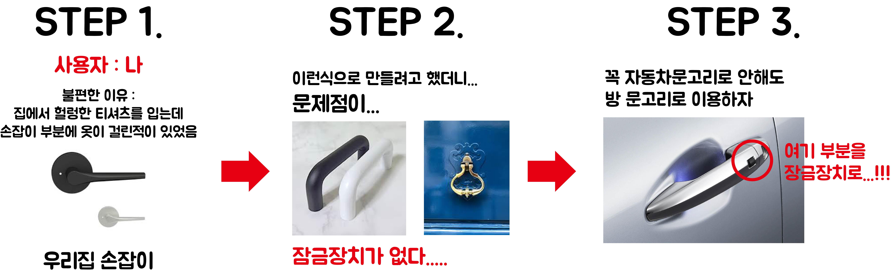

### 잊지말아야 할아야 할 UX_UI의 세가지 요소

####  1. 기능성과 사용성

과거 물자가 귀해서 **선택을 강요** 받던 시대에서는 **기능성**에 중심을 주었지만, 지금은 선택을 하는 사용자의 **사용성**이 중요하다!!!

-> 기능성보다는 사용성 시대이다

####  2. 피드백(즉각적인 반응)

- UX는 사용자의 경험이기 때문에 사용자의 피드백이 중요하다

- 피드백은 사용자의 행동이 나오고 반응이나오면 수정하고 하는 행위를 피드백이라고 한다   ex) 아프리카TV

현상의 이해, 니즈의 변화파악, 소비자 만족제고 - > 컨텐츠의 성공

#### 3. 의미의 전달

: 의미를 캐내는 과정은 스토리, 스토리텔링이 중요하다

-> 서비스를 사용하는 사람을 감동시켜야한다

-> 유머와 재미 감동으로 인간적인 감성에 어필해야 한다

- 사용자에대한 다양한 리서치과정을 통해서 의미있는 정보를 캐내야한다
-  숨어있는 정보를 찾기 위해서 다양한 리서치와 모델평가를 진행한다

### 문고리 디자인하기

### 아이디어 도출하기

문화 콘테츠란?  재미있는 **문화**적인 요소를 **디지털매체**를 통해 사람들에게 전달하여 **상업적 이윤**을 창출하는 것

스마트 문화 콘테츠란?  스마트 기기 + 문화 콘텐츠

ex) 가상현실, 무인자동차,  스마트홈 서비스, 이것들을 총괄하는 디바이스

-> 수평적인 구조화 **아이디어**가 핵심!!!!!

### 콘셉트의 이해

콘셉트는 목적을 이루기 위한 방향

